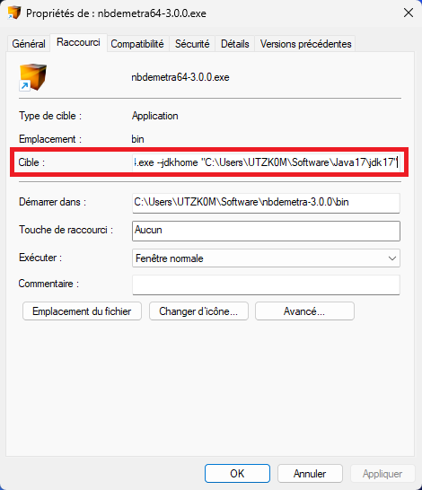
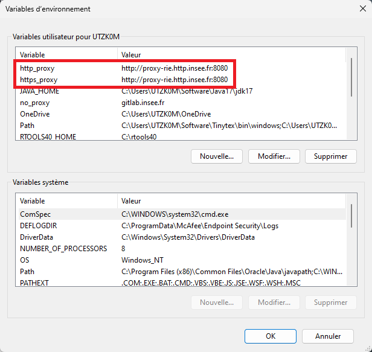
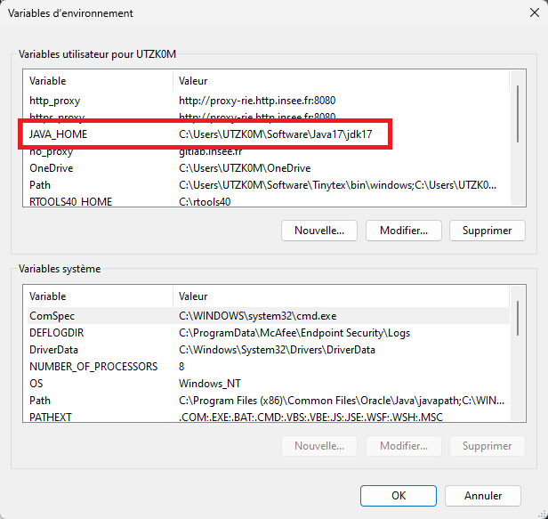

Installation des outils pour la désaisonnalisation
================
Tanguy BARTHELEMY
2023-01-17

# Contexte

Les outils d’aide à la désaisonnalisation sont :

- **R** et Rstudio
- JDemetra+

⚠️ Aucune assistance en langage **SAS** n’est apportée. ⚠️

# Préalable

Sur les ordinateurs sans droits d’administrateur (*postes professionnels
par exemple*), il est conseillé de créer un dossier **Software** sous
C:\Users\\\Software ou directement sous C:\Users\Software dans lequel
tous les logiciels seront installés.

⚠️ Attention : lorsqu’on précise un chemin **absolu** de logiciel
(JDemetra+, Java, **R**, …) dans un programme, un raccourci, une
variable, …, il doit être modifié à chaque fois qu’un des répertoires
racines du logiciel est déplacé.

# Installation de [JDemetra+](https://github.com/jdemetra/jdemetra-app)

JDemetra+ est une galerie de programmes Java servant à l’étude des
séries temporelles et plus particulièrement à la désaisonnalisation.
JDemetra+ est livrée sous la forme d’une IHM (Interface Homme Machine)
mais il existe des packages **R** développés pour l’utiliser aussi sur
**R** ainsi qu’un cruncher (executable).

## Version de JDemetra+ et dépendances

JDemetra+ est téléchargeable depuis le lien
[github](https://github.com/jdemetra/jdemetra-app/releases) de
l’application : <https://github.com/jdemetra/jdemetra-app/releases>.

La dernière release
([v2.2.4](https://github.com/jdemetra/jdemetra-app/releases/tag/v2.2.4))
date du 31 janvier 2023. C’est la dernière version **stable** de
JDemetra+. **C’est cette version qu’il convient de télécharger et
d’utiliser en production.**

Il existe une autre version de JDemetra+ qui en est uniquement au stade
de **test** :

- [v3.0.2](https://github.com/jdemetra/jdplus-main/releases/tag/v3.0.2)
  : la nouvelle version de JDemetra+ avec de nouvelles fonctionnalités
  et une nouvelle interface

La v2.2.4 de JDemetra+ nécessite une version de Java $\geq 8$ alors que
la v3.0.0 nécessite une version de Java $\geq 17$ :

| JDemetra+ version | Java version |
|-------------------|--------------|
| v2.2.4            | $\geq 8$     |
| v3.0.2            | $\geq 17$    |

Pour la suite, les processus d’installation de ces 3 versions sont les
mêmes. Il suffit de les répéter pour chaque version que l’on veut
installer.

## Processus d’installation

Deux solutions pour l’installer :

- **Télécharger et exécuter** le fichier `.exe` qui nécessite des droits
  d’administrateur
- **Télécharger** et **dézipper** le dossier compressé `.zip` qui permet
  d’avoir une version portable du logiciel.

⚠️ Attention : pour la seconde option il faut **télécharger** le dossier
compressé `jdemetra+-2.2.4-bin.zip` (pour la version 2.2.4 par exemple)
et **non** le dossier `Source code (zip)`.

Le logiciel se trouve alors dans le dossier \nbdemetra\bin\\ ce sont les
fichiers `nbdemetra.exe` (version 32-bit) et `nbdemetra64.exe` (version
64-bit).

ℹ️ Conseil : si vous comptez utiliser plusieurs version de JDemetra+
(v2.2.4, v3.0.0, …), vous pouvez renommer les dossiers dézippés en
\nbdemetra-2.2.4\\ et \nbdemetra-3.0.0\\

ℹ️ Remarque : Vous pouvez créer des raccourcis des exécutables si vous
souhaitez les lancer depuis le bureau ou d’autres dossiers.

## Installation du cruncher

Le cruncher
([**JWSACruncher**](https://github.com/jdemetra/jwsacruncher)) est un
outil qui permet de mettre à jour un workspace de JDemetra+ à partir de
la console, sans devoir ouvrir JDemetra+. La mise à jour d’un workspace
peut alors se faire à partir d’un autre logiciel statistique (**R** ou
**SAS** par exemple).

Pour utiliser le cruncher, il faut:

- **Télécharger** et **Dézipper** le fichier
  `jwsacruncher-2.2.4-bin.zip` de la dernière version **stable**
  (**Latest** v2.2.4 disponible ici
  <https://github.com/jdemetra/jwsacruncher/releases>)

Si l’on utilise une version portable de Java (voir section [Installation
Java](#install_java)), il faut encore modifier certains paramètres pour
utiliser le cruncher :

- Dans le dossier dézippé, **ouvrir** (par exemple avec Notepad++) le
  fichier `jwsacruncher.bat` présent dans le sous-dossier \bin\\
  (c’est-à-dire sous jdemetra-cli-2.2.4\bin\\ dans la version 2.2.4 du
  cruncher)
- **Modifier** la valeur de la variable `JAVACMD` de la ligne **71**
  (actuelle `JAVACMD=java`) par l’adresse vers le fichier `java.exe` de
  la version portable . Ainsi, si JPortable est installé sous
  C:\Users\Software, la nouvelle ligne est
  `if "%JAVACMD%"=="" set JAVACMD="C:\\Users\\Software\\Java64\\bin\\java"`
  (pour Java 8).

# Installation de Java

ℹ️ Sur les ordinateurs Insee, Java est déjà installé en version 8.
Ainsi, il n’y a pas besoin d’installer de version portable de Java pour
utiliser JDemetra+ en version 2.2.4.

## Java 8

Pour installer Java 8, utiliser le lien
<https://portableapps.com/apps/utilities/java_portable>. Si l’on utilise
la version 64-bit de JDemetra+, il faut bien installer la version
jPortable 64-bit (en bas de la page).

## Java 17

Pour installer Java 17, il faut aller à l’adresse
<https://www.oracle.com/java/technologies/javase/jdk17-archive-downloads.html>.

- **Télécharger** la version `Compressed Archive` de Windows
  (<https://download.oracle.com/java/17/archive/jdk-17.0.4.1_windows-x64_bin.zip>)
- **Dézipper** le dossier jdk-17.0.6 sous C:\Users\Software (*par
  exemple*)

Après avoir installé Java (en version 8, 17 ou autre), il faut :

- **Modifier** les variables d’environnement de `PATH` de Rstudio et de
  Windows (voir section [Variables d’environnement](#var_env))
- **Modifier** les cibles de JDemetra+ pour informer de la localisation
  des nouvelles versions de Java.

Ainsi par exemple, si vous avez installé la version 17 de Java pour
utiliser la version 3.0.0 de JDemetra+. Il est nécessaire d’ajouter la
localisation de Java 17 au raccourci de l’exécutable grace à l’option
`--jdkhome`. La cible du raccourci devient
`C:\Users\Software\nbdemetra-3.0.0\bin\nbdemetra64.exe --jdkhome "C:\Users\Software\Java17\jdk17"`



# Installation de **R** et Rstudio

Les fonctionnalités de JDemetra+ sont accessibles sur **R** via des
packages **R**. Pour utiliser **R**, mieux vaut utiliser un IDE donc
Rstudio. Tous les exécutables à télécharger sont sous
<https://posit.co/download/rstudio-desktop/#download>.

## Installation de **R**

Pour installer **R**, il faut :

- **Télécharger** le fichier binaire `R-4.3.1-win.exe` sous
  <https://cran.rstudio.com/bin/windows/base/>
- **Exécuter** l’exécutable pour paramétrer et installer **R**.

## Installation de Rstudio

**Télécharger** la dernière version de Rstudio (sous
<https://posit.co/download/rstudio-desktop/#download>) et
l’**installer**.

Si l’installation via le fichier `.exe` échoue (car nécessite des droits
supérieurs (administrateur, élévation, …), nous allons récupérer une
version portable du logiciel. Pour cela :

- **Télécharger** et **dézipper** le dossier compressé `.zip` dans un
  dossier Rstudio (sous C:\Users\Software)
- **Créer un raccourci** du fichier `rstudio.exe` sur le Bureau

## Installation des packages **R**

Pour installer un package **R**, il y a plusieurs méthodes :

- Soit le package est disponible sur le CRAN et il est installable
  directement avec la fonction `install.packages()`
- Soit le package se trouve sur Github et il est installable directement
  avec la fonction `install_github()` du package **remotes**
- Sinon il faut l’installer depuis une version locale (format binaire
  `.zip`) et l’installer avec la fonction `install.packages()` et les
  arguments `repos = NULL, type = "binary"`.

### En version 2

Les packages en version 2 sont les suivants :

| Nom           | Disponible sur le CRAN | Disponible sur AUS | Lien Github                                  |
|---------------|------------------------|--------------------|----------------------------------------------|
| RJDemetra     | ✔️                     | ✔️                 | <https://github.com/jdemetra/rjdemetra>      |
| rjdworkspace  | ❌                     | ✔️                 | <https://github.com/InseeFrLab/rjdworkspace> |
| JDCruncheR    | ❌                     | ✔️                 | <https://github.com/InseeFr/JDCruncheR>      |
| rjwsacruncher | ✔️                     | ✔️                 | <https://github.com/AQLT/rjwsacruncher>      |
| rjdmarkdown   | ✔️                     | ✔️                 | <https://github.com/AQLT/rjdmarkdown>        |

Le code d’installation des packages est ci-dessous :

``` r
# Si le package remotes n'est pas installé
# install.packages("remotes")

install.packages("RJDemetra")
install.packages("rjwsacruncher")
install.packages("rjdmarkdown")

remotes::install_github("InseeFrLab/rjdworkspace")
remotes::install_github("InseeFr/JDCruncheR")

# Sous AUS
# install.packages("rjdworkspace")
# install.packages("JDCruncheR")
```

### En version 3

Pour l’instant aucun package de la version 3 n’est sur le CRAN. Pour
installer les packages, il faut passer par Github :

``` r
# Si le package remotes n'est pas installé
# install.packages("remotes")
remotes::install_github("rjdemetra/rjd3toolkit")

remotes::install_github("rjdemetra/rjd3tramoseats")
remotes::install_github("rjdemetra/rjd3x13")

remotes::install_github("rjdemetra/rjdemetra3")
remotes::install_github("rjdemetra/rjd3revisions")
remotes::install_github("rjdemetra/rjd3x11plus")

remotes::install_github("rjdemetra/rjd3sts")
remotes::install_github("rjdemetra/rjd3highfreq")
remotes::install_github("rjdemetra/rjd3stl")
remotes::install_github("rjdemetra/rjd3bench")
# options : INSTALL_opts = "--no-multiarch"

remotes::install_github("AQLT/ggdemetra3")
```

### Cas AUS

Pour installer un package sur AUS, il n’est pas possible d’utiliser la
fonction `install_github()`. Ainsi, si le package n’est pas sur le CRAN
ni sur le nexus d’AUS, il doit être téléchargé au format binaire. Pour
cela, il faut aller chercher le dossier compressé `.zip` sous GitHub.

Exemple pour le package **rjd3toolkit**, le `Source code (tar.gz)` se
trouve sous
<https://github.com/rjdemetra/rjd3toolkit/releases/tag/v3.0.0>
(*release* Section). Après l’avoir récupéré, il faut lancer la commande
d’installation :

``` r
install.packages("path/.../rjd3toolkit_3.0.0.tar.gz ",
                 repos = NULL, type = "binary")
```

# Variables d’environnement

## Sous Rstudio

Pour ajouter des variables d’environnement sous Rstudio, il faut ajouter
le nom de la variable et sa valeur. Il y a 2 manières de le remplir :

- Utiliser le fichier `.Renviron` :

  - **Lancer** le code `file.edit("~/.Renviron")` ou
    `usethis::edit_r_environ()` (avec le package **usethis** et
    l’argument `scope` qui vaut `"user"` ou `"project"` si vous êtes
    dans un R project)
  - **Ajouter** les variables au fichiers (sous la forme de nouvelles
    lignes)
  - **Enregistrer** le fichier

- Utiliser le fichier `.Rprofile` :

  - **Lancer** le code `file.edit("~/.Rprofile")` ou
    `usethis::edit_r_profile()` (avec le package **usethis** et
    l’argument `scope` qui vaut `"user"` ou `"project"` si vous êtes
    dans un R project)
  - **Ajouter** les variables grâce à la fonction `Sys.setenv()` (sous
    la forme de nouvelles lignes)
  - **Enregistrer** le fichier

### Proxy

Pour les postes Insee, il faut **configurer** le proxy et des paramètres
de localisation des logiciels sous Rstudio. Les deux manières de faire
sont :

Méthode 1 (avec le `.Renviron`) :

- **Lancer** le code `file.edit("~/.Renviron")` ou
  `usethis::edit_r_environ()` (avec le package **usethis** et l’argument
  `scope` qui vaut `"user"` ou `"project"` si vous êtes dans un R
  project)

- **Ajouter** les paramètres (nouvelles lignes) :

  ``` Code
  http_proxy = http://proxy-rie.http.insee.fr:8080/
  https_proxy = http://proxy-rie.http.insee.fr:8080/
  ```

- **Sauvegarder** et **fermer** le fichier

Méthode 2 (avec le `.Rprofile`) : - **Lancer** le code
`file.edit("~/.Rprofile")` ou `usethis::edit_r_profile()` (avec le
package **usethis** et l’argument `scope` qui vaut `"user"` ou
`"project"` si vous êtes dans un R project) - **Ajouter** les lignes
suivantes :

    ```r
    Sys.setenv("http_proxy" = "http://proxy-rie.http.insee.fr:8080/")
    Sys.setenv("https_proxy" = "http://proxy-rie.http.insee.fr:8080/")
    ```

- **Enregistrer** le fichier

### JAVA_HOME

Si une nouvelle version de Java a été installé (Java 17 par exemple), il
faut préciser à Rstudio la localisation de l’installation. Pour cela, il
suffit de faire comme pour paramétrer le proxy. Le nom de la variable
est `JAVA_HOME` et la valeur de la variable
`"C:/Users/Software/Java17/jdk17"` (selon l’emplacement de ton
installation de java).

## Sous Windows

Sous Windows, il peut être utile de renseigner aussi les variables
d’environnement.

### Proxy

Pour les variables d’environnement `http_proxy` et `https_proxy` sous
Windows, il faut :

- Rechercher “Modifier les variables d’environnement pour votre compte”
- Cliquer sur l’application
- Ajouter les variables `http_proxy` et `https_proxy` si elles
  n’existent pas et les modifier si elles existent :



### JAVA_HOME

De même pour la variable d’environnement `JAVA_HOME` pour Windows, comme
pour la configuration du proxy, il faut :

- Rechercher “Modifier les variables d’environnement pour votre compte”
- Cliquer sur l’application
- Ajouter une variable `JAVA_HOME` si elle n’existe pas et la modifier
  si elle existe :



### PATH

La variable d’environnement `PATH` en **R** sert à indiquer à **R** où
chercher les fichiers exécutables.

Lorsque vous installer un nouveau logiciel *(exemple JDemetra+, Rtools,
Java…)* dont Rstudio fera appel, il faut modifier cette variable
d’environnement :

- **Récupérer** l’actuelle valeur de la variable `PATH` via la commande
  `Sys.getenv("PATH")` (Rstudio renvoie alors une succession d’adresse
  du type `C:/WINDOWS/system32;C:/WINDOWS`)

- **Copier-coller** ces adresses après `PATH =` et y ajouter les chemins
  vers les répertoires \bin\\ (binary) des logiciels nouvellement
  installés, en les séparant par des points-virgules sans espace avant
  ni après.

  Par exemple, pour l’installation de Rtools, le chemin est
  C:\rtools42\mingw64\bin (selon là où a été installé Rtools). Il faut
  donc rajouter `C:\\rtools42\\mingw64\\bin` ou
  `C:/rtools42/mingw64/bin` (En **R**, `\` est un caractère spécial,
  donc il faut remplacer les `\` par `/` ou par `\\`). Le chemin devient
  `C:/WINDOWS/system32;C:/WINDOWS;C:/rtools42/mingw64/bin`.

- **Modifier** la variable avec la fonction `Sys.setenv()`.

  Pour l’exemple ci-dessus, la commande à lancer est :

  ``` r
  Sys.setenv(PATH = "C:/WINDOWS/system32;C:/WINDOWS;C:/rtools42/mingw64/bin")
  ```

ℹ️ NB : Généralement une version 32 bits et une version 64 bits sont
disponibles au téléchargement et à l’installation d’un logiciel. Il faut
vérifier le type de processeur de votre Système d’exploitation afin de
choisir le bon dossier propre à votre version système.

Pour cela, vous pouvez lancer les commandes suivantes :

``` r
Sys.getenv("R_ARCH")
Sys.info()[["machine"]]
```

Selon le résultat, la version est 32 bits ou 64 bits :

| Version | Output |
|---------|--------|
| 64 bits | /x64   |
|         | x86-64 |
|         |        |
| 32 bits | /i386  |
|         | x86_32 |

Plus d’informations sur la variable `PATH` via la page
<https://java.com/fr/download/help/path.xml>.

# Vérifications

Pour s’assurer que tout fonctionne bien, on peut faire tourner des
exemples de code et vérifier qu’il n’y a pas d’erreurs :

``` r
library("RJDemetra")

myseries <- ipi_c_eu[, "FR"]
x13_model <- x13(myseries) # X-13ARIMA method
ts_model <- tramoseats(myseries) # TRAMO-SEATS method

# Basic plot with the original series, the trend and the SA series
plot(x13_model, type_chart = "sa-trend")
```

Pour vérifier la version de Java que l’on utilise sous **R**, on peut
essayer d’installer et utiliser le package **rJava** et lancer la
commande ci-dessous :

``` r
# Si le package rJava n'est pas installé
install.packages("rJava")
```

Si l’installation de **rJava** retourne une erreur, cela veut dire que
Java a été mal installé ou mal configuré sur **R**. Il faut retourner à
la section [Variables d’environnement](#var_env).

Ce bloc de commande teste la version de Java avec laquelle **R**
fonctionne :

``` r
library("rJava")
.jinit()
.jcall("java/lang/System", "S", "getProperty", "java.runtime.version")
```

Enfin, on peut consulter la version de Java installé sur notre poste et
avec laquelle Windows fonctionne (cela n’a pas d’importance pour nous) :

``` r
system("java -version")
```

# Installations optionnelles

Certaines installations supplémentaires sont optionnelles (c’est-à-dire
qu’elles ne sont pas obligatoires mais apportent des fonctionnalités
externes) :

- [Miktek](https://miktex.org/howto/install-miktex) pour produire des
  documents latex
- [Rtools](https://cran.r-project.org/bin/windows/Rtools/rtools42/rtools.html)
  pour développer des packages et compiler du code

# Problèmes que l’on peut rencontrer

## Problème d’installation de package **R**

Si lors de l’installation de packages, vous obtenez l’erreur suivante :

``` r
install.packages("RJDemetra")
```

    ## Error in eval(expr, envir, enclos): Erreur : le chargement a échoué
    ## Exécution arrêtée
    ## *** arch - x64

Le problème ne vient pas de Java mais du package **R**. Par défaut, le
package s’installe depuis le fichier “source”, c’est-à-dire que le
package est recompilé. Pour certaines raisons informatiques, lorsqu’on
compile par défaut, ce sont les paramètres système de base qui sont
utilisés (et qui n’ont pas forcément les bonnes versions de Java).

Deux solutions :

- Compiler le package en installant depuis le “binary” :

  ``` r
  install.packages("RJDemetra", type = "binary")
  ```

- Spécifier que l’on veut utiliser les paramètres locaux :

  ``` r
  install.packages("RJDemetra", type = "source", INSTALL_opts = "--no-multiarch")
  ```

ℹ️ Plus d’information :
<https://github.com/jdemetra/rjdemetra/wiki/Installation-manual>

## La commande `library("RJDemetra")` renvoie un message d’erreur

Le package **RJDemetra** a besoin de la version 8 (au minimum) de Java
pour fonctionner. Si au moins un autre package a déjà été chargé via la
fonction `library()` et qu’il ne nécessite pas une version très à jour
de Java, c’est cette ancienne version qui sera sollicitée pendant toute
la durée de la session (**R** est réfractaire au changement de version
en cours de session). En cas d’utilisation de **RJDemetra** au cours
d’un programme, il faut donc impérativement spécifier dès le début de
programme que **R** aille chercher la version 8, via la commande :

``` r
# Là où est installé java
Sys.setenv(JAVA_HOME = "C:/Users/Software/Java17/jdk17")
```

ou charger **RJDemetra** en premier

``` r
# En début de programme
library("RJDemetra")
```

Sinon il faut redémarrer une nouvelle session **R**.

## `Error array index = -1`

Le message du type `Error array index = -1` indique une variable
auxiliaire non trouvée. Il peut s’agir de régresseurs CJO ou d’autres
variables définies par l’utilisateur (effet de Pâques spécifique, PSO =
pure seasonal outlier…).

## La fonction `cruncher_and_param(...)` du package **JDCruncheR** renvoie un message d’erreur

Lorsqu’on lance la fonction `cruncher_and_param(...)` du package
**JDCruncheR**, on peut obtenir l’erreur suivante :

    ## Error in eval(expr, envir, enclos): Error in cruncher(workspace = workspace, cruncher_bin_directory = cruncher_bin_directory,  : 
    ##   There is an error in the path to the cruncher bin folder

Cela veut dire que le chemin jusqu’au cruncher a mal été configuré. Pour
remédier à cela, il faut préciser à R le chemin du cruncher en début de
programme avec la fonction `options(...)` :

``` r
options(cruncher_bin_directory = "C:/Users/Software/jwsacruncher-2.2.4-bin/bin")
```

Pour vérifier que le chemin est bien valide, il faut utiliser la
fonction `getOption(...)` :

``` r
getOption("cruncher_bin_directory")
```
