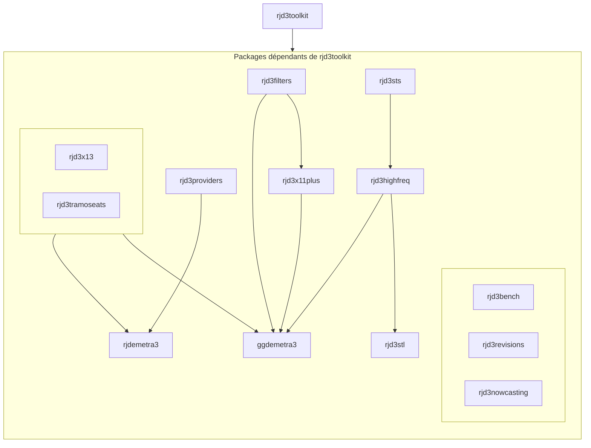

# 🇫🇷 Projet JD Tutorials : Bien utiliser JDemetra+
# 🇬🇧 JD Tutorials project: Make good use of JDemetra+

## Objectifs 🇫🇷

L'objectif du projet **JD Tutorials** est de faciliter l'utilisation de JDemetra+, aussi de l'interface graphique (GUI, Graphical user Interface) que des packages R qui donnent également accès aux algorithmes de JDemetra+.

Ce projet est complémentaire à la [documentation](https://jdemetra-new-documentation.netlify.app/) en ligne. Nous y proposons des vidéos, des tutoriels et des guides d'installation des différents outils autour de JDemetra+.

## Motivation 🇬🇧

The aim of the **JD Tutorials** project is to make JDemetra+ easier to use, both with the Graphical User Interface (GUI) and with the companion R packages, which also provide access to JDemetra+ algorithms.

This project complements the online [documentation](https://jdemetra-new-documentation.netlify.app/). Here you'll find videos, tutorials and installation guides for the various JDemetra+ related tools.

## Structure

## Réseaux / Networks
- ▶️ [YouTube](https://www.youtube.com/@TSwithJDemetraandR) : @TSwithJDemetraandR
- 📚 [JD+ Documentation](https://jdemetra-new-documentation.netlify.app/)
- 📝 [Blog](https://jdemetra-universe-blog.netlify.app/)
- 🖥️ GitHub Tanguy Barthelemy: https://github.com/TanguyBarthelemy
- 🖥️ GitHub Anna Smyk: https://github.com/annasmyk
