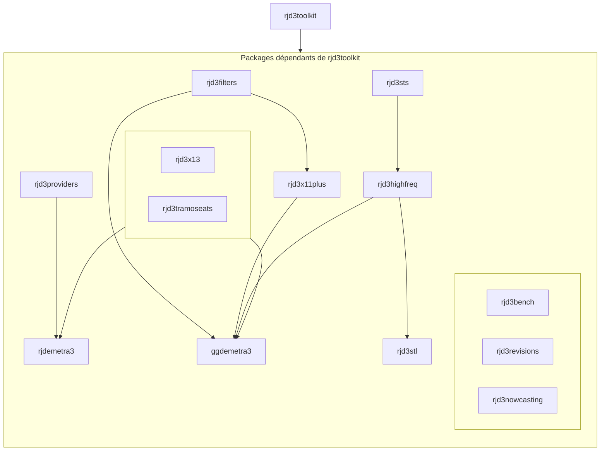

# 🇫🇷 Projet JD Tutorials : Comment désaisonnaliser avec JDemetra+ ?
# 🇬🇧 JD Tutorials project: Seasonnal adjustment with JDemetra+

## Français 🇫🇷

### But

Les objectifs du projet **JD Tutorials** est d'apporter des outils d'aide à l'utilisation de JDemetra+ aussi bien pour l'utilisation de la GUI (Graphical user Interface) que des packages R qui accompagne JDemetra+.

Ce projet est complémentaire à la [documentation](https://jdemetra-new-documentation.netlify.app/) en ligne en apportant des vidéos, des tutoriels et des guides d'installation des différents outils.

## English 🇬🇧

### Objectives

The objectives of the project **JD Tutorials** is to bring helping tools to use JDemetra+ both for using the GUI (Graphical user Interface) and the R packages which are related to JDemetra+.

This project is complementary to the [online documentation](https://jdemetra-new-documentation.netlify.app/) by bringing videos, tutorials and installation guideset for the different tools.

### Structure

## Réseaux / Networks
- ▶️ [YouTube](https://www.youtube.com/@TSwithJDemetraandR) : @TSwithJDemetraandR
- 📚 [JD+ Documentation](https://jdemetra-new-documentation.netlify.app/)
- 📝 [Blog](https://jdemetra-universe-blog.netlify.app/)
- 🖥️ GitHub Tanguy : https://github.com/TanguyBarthelemy
- 🖥️ GitHub Anna : https://github.com/annasmyk
